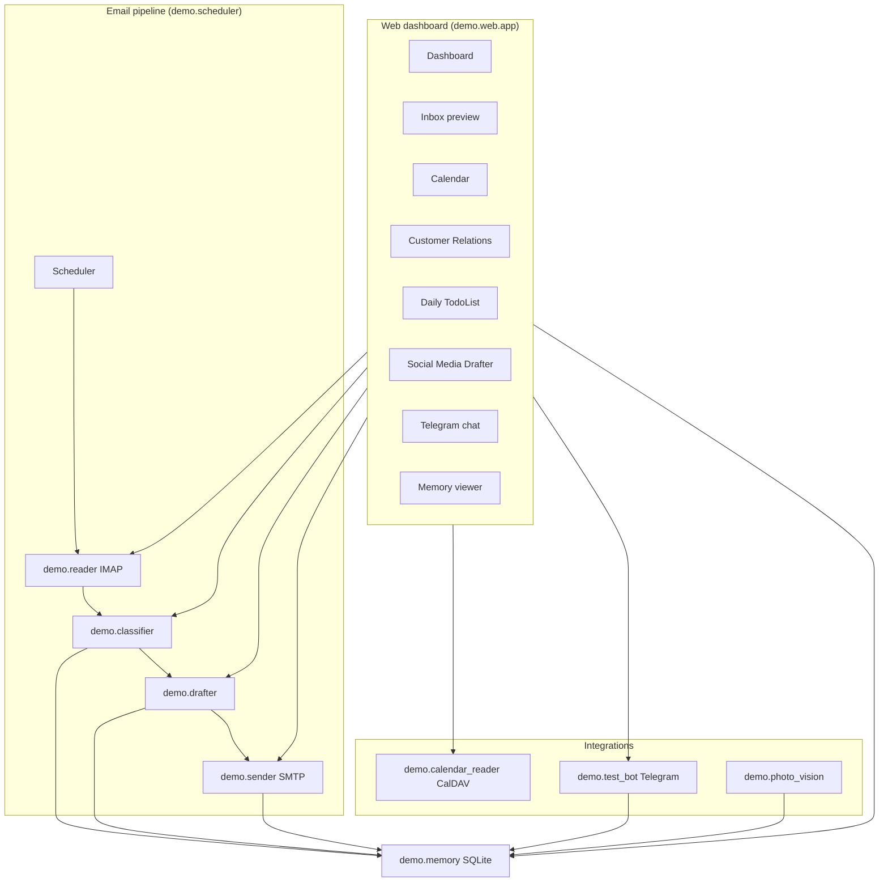

# System Architecture

**CEM501 Communication Skills for CEM — Spring 2026**  
**Milestone M8/M9 — Final integrated agent (Poder)**

> Runnable code lives in **`demo/`**. Detailed module paths and run commands: **[`demo/ARCHITECTURE.md`](demo/ARCHITECTURE.md)**.  
> Root **`reader.py`** and **`test_bot.py`** are thin shims to `demo`.

---

## System Overview

Poder is a **modular, localhost-first communication agent** for construction and startup workflows. It reads email over **IMAP**, **classifies** urgency (Claude or keyword rules), **drafts** replies (Claude or templates), **persists** context in **SQLite**, optionally **sends** via **SMTP**, and exposes a **Flask web dashboard** for human review of every outbound action. **Telegram** handles field messaging; **CalDAV** connects Gmail calendar for scheduling.

**Design principles:** modularity (each feature is a testable pane/API), human-in-the-loop (draft ≠ send without review), local trust (bind `127.0.0.1`, no cloud deployment required for demo).

### Architecture Diagram



Legacy ASCII (core email loop):

```
┌─────────────────────────────────────────────────────────┐
│              Scheduler  OR  Web Inbox / API             │
└──────────────────────┬──────────────────────────────────┘
                       v
┌──────────┐    ┌──────────────┐    ┌──────────────┐
│  Reader  │───>│  Classifier  │───>│   Drafter    │
│  (IMAP)  │    │   (LLM)      │    │   (LLM)      │
└──────────┘    └──────────────┘    └──────┬───────┘
                                          │
                       ┌──────────────────┼──────────────────┐
                       v                  v                  v
                ┌──────────────┐   ┌──────────────┐   ┌──────────────┐
                │    Sender    │   │  Web review  │   │   Telegram   │
                │   (SMTP)     │   │  (Flask UI)  │   │  (test_bot)  │
                └──────────────┘   └──────────────┘   └──────────────┘
                       │                  │                  │
                       v                  v                  v
                ┌──────────────────────────────────────────────────┐
                │  Memory (SQLite): contacts, messages, tasks,    │
                │  daily_todos, telegram_chats, pipeline_stage     │
                └──────────────────────────────────────────────────┘
```

---

## Components

### Reader — `demo/reader.py`

Connects to **IMAP** (`EMAIL_ADDRESS`, app password), fetches recent messages, parses MIME, exposes **`read_recent_emails()`** for the scheduler and **`/api/inbox`** for the web UI. Includes keyword **`triage_email`** fallback for classification.

### Classifier — `demo/classifier.py`

Assigns **`URGENT | ACTION | FYI | ARCHIVE`**. Uses **Claude** when `ANTHROPIC_API_KEY` is set; otherwise **`reader.triage_email`** rules.

### Drafter — `demo/drafter.py`

- **`draft_email_reply()`** — professional email replies for inbox/scheduler  
- **`draft_response()`** — short Telegram replies  
- **`draft_social_post()`** — LinkedIn / Instagram captions from rough notes  
- Template fallbacks when API key is absent  

### Sender — `demo/sender.py`

Sends plain-text mail via **SMTP** (STARTTLS). Used by scheduler (non–dry-run) and web **`/api/send`**, **`/api/inbox/reply`** when **`WEB_ALLOW_SEND=1`**.

### Memory — `demo/memory.py`

**SQLite** at `demo/memory/memory.db`:

| Table / feature | Purpose |
|-----------------|--------|
| `contacts` | CRM customers + **`pipeline_stage`** (cold_call → accepted) |
| `message_history` | Email and agent draft log |
| `scheduled_tasks` | URGENT/ACTION follow-ups |
| `daily_todos` | Checklist and notes |
| `telegram_*` | Chat list and message log |

### Scheduler — `demo/scheduler.py`

Orchestrates **read → classify → draft → memory log → optional send**. Flags: **`--once`**, **`--dry-run`**, **`--max-emails N`**, **`--interval-mins N`**.

### Messenger (Telegram) — `demo/test_bot.py`

**python-telegram-bot** handler: classify → draft → reply; photo messages via **`photo_vision`**. Web **`/api/telegram/*`** can send replies when **`WEB_ALLOW_SEND=1`**.

### Calendar — `demo/calendar_reader.py`

**CalDAV** read/create against Gmail primary calendar (same credentials as IMAP). Powers dashboard month grid, Calendar module, and **`/api/calendar/events`**. Todo items can spawn events via **`/api/todos/<id>/event`**.

### Web dashboard — `demo/web/`

**Flask** app (`demo/web/app.py`) + single-page UI (`templates/index.html`):

| Module | API / behavior |
|--------|----------------|
| Dashboard | `GET /api/dashboard/summary` |
| Inbox preview | `GET /api/inbox`, suggest/send reply |
| Customer Relations | `GET/POST/PUT/DELETE /api/crm/customers`, pipeline PATCH |
| Calendar | CalDAV list + create |
| Daily TodoList | CRUD `/api/todos`, event creation |
| Social Media Drafter | `POST /api/social/draft` |
| Telegram chat | chats, messages, send |
| Memory | `GET /api/memory/*` |

Binds **`127.0.0.1`** only. See [WEB_KULLANIM_KITAPCIGI.txt](WEB_KULLANIM_KITAPCIGI.txt).

---

## Data Flow

### Email pipeline (scheduler or inbox)

1. **Reader** fetches recent mail from IMAP.  
2. **Classifier** labels each message.  
3. **Drafter** generates a reply draft.  
4. **Memory** logs received message + draft artifact; schedules follow-up for URGENT/ACTION.  
5. **Sender** sends only if not `--dry-run` and user approves (web) or scheduler runs live.  

### Web human-in-the-loop

1. User selects email in **Inbox preview**.  
2. UI calls **`/api/inbox/suggest-reply`** → draft + alternatives.  
3. User edits and clicks **Send reply** → SMTP (if enabled).  

### CRM pipeline

1. Contacts stored in SQLite with **`pipeline_stage`**.  
2. Kanban drag-and-drop updates stage via **`PATCH /api/crm/customers/<id>/pipeline`**.  
3. **Reply via email** opens Inbox with customer address pre-filled.  

---

## API Keys & Configuration

Secrets in **`project/.env`** (never committed). Template: **`.env.example`**.

| Variable | Purpose |
|----------|---------|
| `ANTHROPIC_API_KEY` | Claude — classify, draft, social posts, photo vision |
| `ANTHROPIC_MODEL` | Optional (default `claude-sonnet-4-6`) |
| `EMAIL_ADDRESS` / `EMAIL_PASSWORD` | IMAP, SMTP, CalDAV (Gmail app password) |
| `IMAP_SERVER` / `SMTP_SERVER` / `SMTP_PORT` | Mail servers |
| `TELEGRAM_BOT_TOKEN` | Telegram bot + web send |
| `TELEGRAM_CHAT_ID` | Optional allowlist |
| `WEB_PORT` | Dashboard port (default 5000) |
| `WEB_ALLOW_SEND=1` | Enable SMTP, Telegram send, calendar/todo writes |

---

## How to Run

```bash
cd project
pip install -r requirements.txt
cp .env.example .env

# Web dashboard
python3 -m demo.web.app

# Email pipeline (log demo — see agent.log)
python3 -m demo.scheduler --once --dry-run --max-emails 5

# Telegram bot
python3 -m demo.test_bot
```

---

## Future Improvements

- [ ] UNSEEN-only fetch + Message-ID deduplication  
- [ ] Attachment parsing (PDF RFIs, submittals)  
- [ ] Proper In-Reply-To / threading headers  
- [ ] Optional Telegram approval step before SMTP send  

---

*CEM501 — Spring 2026 — Dr. Eyuphan Koc — Boğaziçi University*
