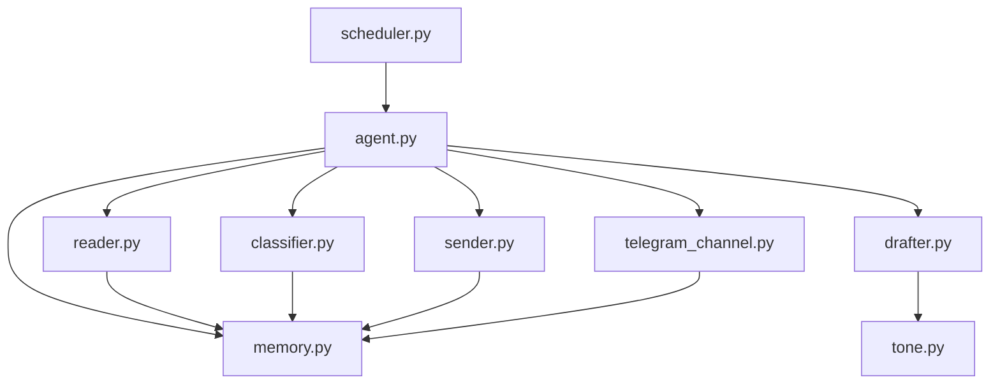

# System Architecture

**CEM501 Communication Skills for CEM -- Spring 2026**
**Milestone M8 Deliverable (Final Integration)**

---

## System Overview

This project implements a modular communication agent for construction management workflows. The agent can read incoming emails, classify and draft responses with LLM assistance, store contact + conversation history for continuity, and schedule follow-ups so communication does not depend on manual reminders. It also supports optional Telegram notifications for human-in-the-loop review, and a minimum cross-cultural adaptation layer via tone presets driven by contact metadata.

### Architecture Diagram

---

## Components

### Reader
**File:** `reader.py`
**Responsibility:** Connects to IMAP, fetches recent emails, parses headers and body, and returns structured `EmailMessage` objects for the rest of the pipeline.
**Key dependencies:** `imaplib` (stdlib), `python-dotenv`

### Classifier
**File:** `classifier.py`
**Responsibility:** Uses Claude (Anthropic) to classify each email into `category` / `urgency` / `kind`. Falls back to simple keyword triage if the API key is missing or the call fails.
**Key dependencies:** `anthropic`, `python-dotenv`

### Drafter
**File:** `drafter.py`
**Responsibility:** Generates a context-aware draft reply using Claude, using (a) the classifier output, (b) recent message history from SQLite memory, and (c) a tone profile derived from contact metadata. Uses markdown templates in `templates/` as optional reference examples.
**Key dependencies:** `anthropic`, `python-dotenv`

### Sender
**File:** `sender.py`
**Responsibility:** Sends the draft via SMTP (TLS). Supports “dry-run” mode upstream so sending can be disabled while still logging/storing drafts.
**Key dependencies:** `smtplib` (stdlib), `python-dotenv`

### Memory
**File:** `memory.py`
**Responsibility:** SQLite-backed persistence (contacts, message_history, scheduled_tasks). Stores contact metadata (`culture_region`, `preferred_tone`) to enable tone adaptation.
**Key dependencies:** `sqlite3` (stdlib)

### Scheduler
**File:** `scheduler.py`
**Responsibility:** Runs the pipeline on a configurable interval, and checks due follow-ups each morning.
**Key dependencies:** `schedule`

### Cultural adaptation (tone/audience)
**File:** `tone.py`
**Responsibility:** Tone presets and greeting/sign-off templates selected from contact metadata (`preferred_tone`, `culture_region`). This is the minimum cross-cultural adaptation feature.
**Key dependencies:** none

### Orchestrator
**File:** `agent.py`
**Responsibility:** Orchestrates the end-to-end flow (read → classify → draft → optional telegram review notify → send/log → schedule follow-ups).
**Key dependencies:** components above

### Messenger (Telegram)
**File:** `telegram_channel.py`
**Responsibility:** Optional human-in-the-loop: posts drafts to a configured Telegram chat for review and logs the notification to memory.
**Key dependencies:** `python-telegram-bot`, `python-dotenv`

---

## Data Flow

1. **Scheduler** triggers the pipeline at a configured interval (e.g., every 5 minutes).
2. **Reader** connects to the IMAP server, fetches new unread emails, and returns structured email data.
3. **Classifier** receives each email and calls the LLM API to determine email type and urgency.
4. **Memory** is queried for any prior conversation context related to the sender or thread.
5. **Drafter** receives the classified email plus conversation history and generates a draft response.
6. [Optional] draft is sent to **Telegram** for human review notification.
7. **Sender** dispatches the draft via SMTP (unless running in `--dry-run`).
8. **Memory** stores received/sent history and scheduled follow-ups.

---

## API Keys & Configuration

All secrets are stored in a `.env` file (never committed to version control). See `.env.example` for the required variables.

| Variable | Purpose |
|----------|---------|
| `ANTHROPIC_API_KEY` | LLM API access for classification and drafting |
| `OPENAI_API_KEY` | Alternative/backup LLM API (if used) |
| `EMAIL_ADDRESS` | IMAP/SMTP email account |
| `EMAIL_PASSWORD` | App-specific password for email access |
| `IMAP_SERVER` | Incoming mail server address |
| `SMTP_SERVER` | Outgoing mail server address |
| `SMTP_PORT` | SMTP port (typically 587 for TLS) |
| `TELEGRAM_BOT_TOKEN` | Telegram bot for notifications/approval (if used) |
| `TELEGRAM_CHAT_ID` | Telegram chat ID for review notifications (if used) |
| `ANTHROPIC_MODEL` | Optional override for model name (default: `claude-3-5-sonnet-latest`) |

---

## Future Improvements

- [ ] Add robust email threading (In-Reply-To/References) + Gmail labels for processed messages
- [ ] Add attachment parsing (PDF extraction, image OCR)
- [ ] Add a small review dashboard (web or TUI) for approving drafts
- [ ] Expand cultural adaptation to multi-language and per-company style guides

---

*CEM501 - Spring 2026 - Dr. Eyuphan Koc - Bogazici University*
