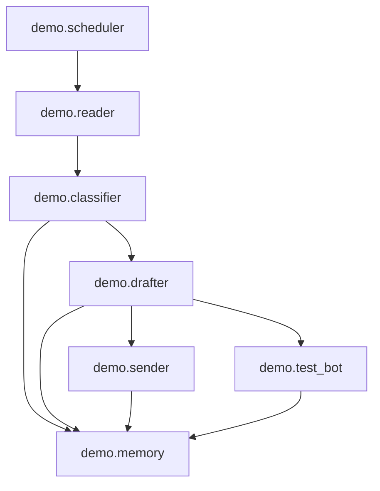

# System Architecture

**CEM501 Communication Skills for CEM -- Spring 2026**  
**Milestone M5 Deliverable** (reference diagram — runnable modules live in **`project/demo/`** as package **`demo`**)

---

## System Overview

This architecture describes a **modular communication agent** for construction workflows: it reads email over **IMAP**, **classifies** urgency/type (rule-based fallback or **LLM**), **drafts** replies (**LLM** or templates), optionally **notifies via Telegram**, **sends** via **SMTP**, and **persists** context in **SQLite** for continuity and scheduled follow-ups. Components stay loosely coupled so each piece can be tested or swapped independently.

### Architecture Diagram



Legacy ASCII overview (same logical flow):

```
┌─────────────────────────────────────────────────────────┐
│                      Scheduler                          │
│               (runs pipeline on interval)               │
└──────────────────────┬──────────────────────────────────┘
                       │
                       v
┌──────────┐    ┌──────────────┐    ┌──────────────┐
│  Reader  │───>│  Classifier  │───>│   Drafter    │
│  (IMAP)  │    │   (LLM)      │    │   (LLM)      │
└──────────┘    └──────────────┘    └──────┬───────┘
                                          │
                       ┌──────────────────┘
                       v
                ┌──────────────┐    ┌──────────────┐
                │    Sender    │    │   Messenger   │
                │   (SMTP)     │    │  (Telegram)   │
                └──────────────┘    └──────────────┘
                       │                    │
                       v                    v
                ┌──────────────────────────────────┐
                │            Memory                │
                │   (conversation history store)   │
                └──────────────────────────────────┘
```

### How to run (from `project/` directory)

```bash
cd project

# Email pipeline once, no SMTP send
python3 -m demo.scheduler --once --dry-run --max-emails 3

# Telegram bot
python3 -m demo.test_bot

# CLI inbox triage table (same implementation via shim)
python3 reader.py

# Web dashboard (Classifier, Drafter, Inbox, Memory, optional SMTP)
pip install flask
python3 -m demo.web.app
# → http://127.0.0.1:5000  (set WEB_PORT to change port)
```

Environment file: **`project/.env`** (see [`../.env.example`](../.env.example)). SQLite DB for this demo: **`demo/memory/memory.db`**.

Optional web-only flags (in `.env`): **`WEB_ALLOW_SEND=1`** enables POST `/api/send` (SMTP); leave unset for safety. **`WEB_PORT=5000`** overrides the dev server port.

---

## Components

### Reader

**File:** [`reader.py`](reader.py)

**Responsibility:** Connects to the configured **IMAP** server (`IMAP_SERVER`, default Gmail), authenticates with `EMAIL_ADDRESS` / `EMAIL_PASSWORD`, selects **INBOX**, fetches the **most recent N messages**, parses MIME (plain/HTML preview via `get_body_preview`), and exposes **`read_recent_emails()`** returning structured dicts (`subject`, `body`, `from_addr`, etc.) for the scheduler/pipeline. **`fetch_recent_emails()`** remains the CLI table view for manual triage.

**Key dependencies:** `imaplib`, `email` (stdlib), `python-dotenv`

---

### Classifier

**File:** [`classifier.py`](classifier.py)

**Responsibility:** Assigns each message an **`URGENT` / `ACTION` / `FYI` / `ARCHIVE`** bucket. With **`ANTHROPIC_API_KEY`**, calls **Claude** and expects JSON `{"category":...}`; on failure or missing key, falls back to **`reader.triage_email`** keyword rules. Exposes **`classify_message()`** (short text / Telegram) and **`classify_email()`** (subject + body + sender).

**Key dependencies:** `anthropic` (optional), `python-dotenv`

---

### Drafter

**File:** [`drafter.py`](drafter.py)

**Responsibility:** Produces a professional **plain-text** reply. With **`ANTHROPIC_API_KEY`**, uses Claude and JSON `{"reply":...}`; otherwise uses **stub templates** by category. **`draft_response()`** serves Telegram-sized replies; **`draft_email_reply()`** builds longer drafts for the email pipeline.

**Key dependencies:** `anthropic` (optional), `python-dotenv`

---

### Sender

**File:** [`sender.py`](sender.py)

**Responsibility:** Sends **one plain-text** email via **SMTP** (`SMTP_SERVER`, `SMTP_PORT`, STARTTLS) using `EMAIL_ADDRESS` / `EMAIL_PASSWORD`. Used when **`demo.scheduler`** runs **without** `--dry-run` and a valid `from_addr` exists.

**Key dependencies:** `smtplib`, `email.mime.*` (stdlib), `python-dotenv`

---

### Memory

**File:** [`memory.py`](memory.py)

**Responsibility:** **SQLite** persistence at `demo/memory/memory.db`: **`contacts`**, **`message_history`** (sent/received, channel), **`scheduled_tasks`** (follow-ups). **`demo.scheduler`** logs received mail and draft-as-sent rows and inserts **urgent / action** follow-up tasks.

**Key dependencies:** `sqlite3` (stdlib)

---

### Scheduler

**File:** [`scheduler.py`](scheduler.py)

**Responsibility:** Orchestrates **`read_recent_emails` → `classify_email` → `draft_email_reply` → memory logging → optional `send_email`**. Runs on an interval (`schedule` library) or **`--once`**. **`--dry-run`** skips SMTP.

**Key dependencies:** `schedule`, `python-dotenv`; package-relative imports [`reader`](reader.py), [`classifier`](classifier.py), [`drafter`](drafter.py), [`memory`](memory.py), [`sender`](sender.py)

---

### Messenger (Telegram)

**File:** [`test_bot.py`](test_bot.py)

**Responsibility:** **Telegram bot** using **`python-telegram-bot`**: on text messages, runs **`classify_message`** then **`draft_response`** and replies in-chat. Token: **`TELEGRAM_BOT_TOKEN`** (or `BOT_TOKEN`) in **`project/.env`**.

**Key dependencies:** `python-telegram-bot`, `python-dotenv`; imports [`classifier`](classifier.py), [`drafter`](drafter.py)

---

### Web dashboard

**Files:** [`web/app.py`](web/app.py), [`web/templates/index.html`](web/templates/index.html), [`web/static/css/site.css`](web/static/css/site.css)

**Responsibility:** Local **Flask** UI plus JSON APIs that call **`demo.classifier`**, **`demo.drafter`**, **`demo.reader`**, read **`demo/memory/memory.db`**, and optionally **`demo.sender`** (SMTP gated by **`WEB_ALLOW_SEND=1`**). Documents CLI usage for **scheduler** and **Telegram**.

**Key dependencies:** `flask`

See [`web/README.md`](web/README.md).

---

## Data Flow

1. **Scheduler** triggers the pipeline at a configured interval (or once via `--once`).
2. **Reader** connects to **IMAP**, fetches recent mail, returns structured rows.
3. **Classifier** labels each item (**LLM** or rules).
4. **Memory** stores **received** rows and links/creates **contacts** when an email address is known.
5. **Drafter** generates a draft reply from subject/body + category.
6. **Memory** logs the draft as a **sent**-direction row (draft artifact) and queues **follow-ups** for **URGENT** / **ACTION**.
7. **[Optional]** **Messenger** (`python3 -m demo.test_bot`) classifies/drafts interactively for humans.
8. **Sender** sends mail **only** when not in `--dry-run` and a **`from_addr`** is present (reply-to-sender pattern).

---

## API Keys & Configuration

All secrets live in **`project/.env`** (not committed). Template: **[`.env.example`](../.env.example)**.

| Variable | Purpose |
|----------|---------|
| `ANTHROPIC_API_KEY` | Claude API for classification + drafting (optional; rules/templates if absent) |
| `OPENAI_API_KEY` | Reserved if you extend `classifier`/`drafter` to OpenAI |
| `EMAIL_ADDRESS` | IMAP/SMTP mailbox |
| `EMAIL_PASSWORD` | App password (e.g. Gmail app password) |
| `IMAP_SERVER` | Incoming server (default `imap.gmail.com`) |
| `SMTP_SERVER` | Outgoing server (default `smtp.gmail.com`) |
| `SMTP_PORT` | SMTP port (default `587`) |
| `TELEGRAM_BOT_TOKEN` | Telegram bot token for `python3 -m demo.test_bot` |
| `ANTHROPIC_MODEL` | Optional override (default `claude-sonnet-4-6`; see [Anthropic models](https://docs.anthropic.com/en/docs/about-claude/models/overview)) |

---

## Future Improvements

- [ ] Filter **UNSEEN** only + mark processed / Message-ID dedupe
- [ ] Attachments (PDF text extraction, OCR)
- [ ] Proper **Reply-To** / **In-Reply-To** threading headers
- [ ] Telegram **approval** workflow before SMTP send

---

*CEM501 - Spring 2026 - Dr. Eyuphan Koc - Bogazici University*
